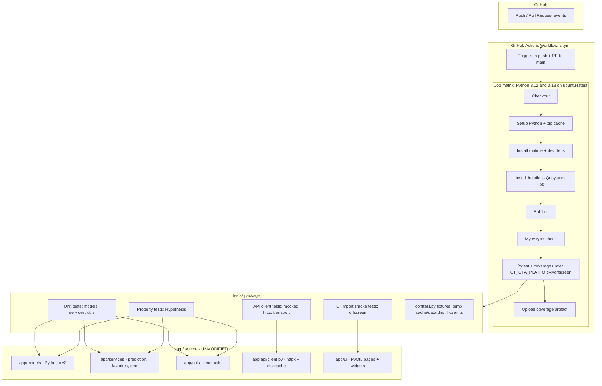
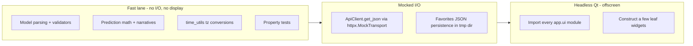

# Design Document: Testing & CI Environment

## Overview

This feature establishes an automated **testing and static-analysis environment** for the World Cup Console (世界杯赛事终端) — a Python 3.12/3.13 + PyQt6 desktop application — that runs entirely inside **GitHub Actions**. Every push and pull request will automatically lint, type-check, and run the test suite against a Python version matrix, so regressions in the pure-logic layers (Pydantic models, the prediction engine, time/geo utilities, the API caching client) are caught before they reach `main`.

The application has two distinct categories of code from a testing standpoint. The **pure-logic core** (`app/models`, `app/services`, `app/utils`, `app/config`) is deterministic, network-free, and trivially testable. The **I/O and UI shell** (`app/api/client.py`, `app/ui/**`, `main.py`) depends on the network, the local filesystem (diskcache via `platformdirs`), and a live display server. The design therefore splits testing into: (1) deep unit + property-based tests of the pure-logic core with all network and filesystem access mocked/redirected, (2) behavioral tests of the API client against a mocked HTTP transport, and (3) lightweight "import smoke" tests of UI modules under a headless Qt platform (`QT_QPA_PLATFORM=offscreen`).

The deliverables are: a `tests/` package with pytest + Hypothesis suites and shared fixtures, a `requirements-dev.txt` for dev/test tooling, configuration for `ruff` (lint) + `mypy` (type-check) + `pytest`/`coverage` (in `pyproject.toml`), and one or more GitHub Actions workflow files under `.github/workflows/`. No application source code under `app/` is modified by this feature — it is purely additive testing infrastructure.

## Architecture



### Layered test strategy (what runs where)



## CI Trigger & Environment Decisions

| Decision | Choice | Rationale |
|----------|--------|-----------|
| Runner OS | `ubuntu-latest` | Cheapest/fastest; Qt offscreen works with system libs. (macOS/Windows can be added later as an optional matrix expansion.) |
| Python versions | `3.12`, `3.13` | `qasync` officially supports `>=3.8,<3.14`; project README mandates 3.12/3.13 and explicitly forbids 3.14. |
| Headless GUI | `QT_QPA_PLATFORM=offscreen` env var | Lets PyQt6 import and instantiate widgets without an X server. Avoids needing `xvfb` for import-level smoke tests. |
| Qt system deps | Install `libegl1`, `libgl1`, `libxkbcommon0`, `libdbus-1-3` (and fallback `xvfb`) | PyQt6 wheels need these shared libraries present even in offscreen mode. |
| Dependency caching | `actions/setup-python` built-in pip cache keyed on requirements files | Speeds up repeat runs. |
| Network in tests | Disabled / mocked | dongqiudi endpoints must never be hit live in CI (flaky, rate-limited, non-deterministic). |

## Components and Interfaces

### Component 1: Dev dependency manifest (`requirements-dev.txt`)

**Purpose**: Pin the test/lint/type-check toolchain separately from runtime deps so CI installs both but end users only need `requirements.txt`.

**Interface (contents contract)**:
```text
-r requirements.txt        # include runtime deps so imports resolve
pytest>=8.2
pytest-cov>=5.0
pytest-asyncio>=0.23       # for async ApiClient tests
hypothesis>=6.100          # property-based testing
ruff>=0.5                  # linter
mypy>=1.10                 # static type checker
respx>=0.21                # httpx request mocking (or use httpx.MockTransport)
```

**Responsibilities**:
- Provide a single install entry point for CI (`pip install -r requirements-dev.txt`).
- Keep runtime `requirements.txt` untouched.

### Component 2: Tooling configuration (`pyproject.toml`)

**Purpose**: Central, declarative config for `pytest`, `coverage`, `ruff`, and `mypy`.

**Interface (config sections)**:
```toml
[tool.pytest.ini_options]
testpaths = ["tests"]
addopts = "-q --strict-markers --cov=app --cov-report=term-missing"
asyncio_mode = "auto"
markers = [
  "ui: tests that import/instantiate PyQt6 components (need offscreen platform)",
  "property: Hypothesis property-based tests",
]

[tool.coverage.run]
branch = true
source = ["app"]
omit = ["app/ui/*"]        # UI excluded from coverage gating (smoke-only)

[tool.ruff]
target-version = "py312"
line-length = 100
[tool.ruff.lint]
select = ["E", "F", "I", "B", "UP"]
# UI files lean on Qt patterns; keep lint pragmatic
[tool.ruff.lint.per-file-ignores]
"app/ui/**" = ["E501"]
"tests/**" = ["E501"]

[tool.mypy]
python_version = "3.12"
ignore_missing_imports = true   # PyQt6/qasync/diskcache stubs are partial
check_untyped_defs = true
# Strictly type the pure-logic core; be lenient on the UI shell
[[tool.mypy.overrides]]
module = "app.ui.*"
ignore_errors = true
```

**Responsibilities**:
- Define test discovery, coverage scope (exclude UI from coverage %), and marker registry.
- Configure ruff to lint the codebase pragmatically (strict on logic, lenient on Qt UI).
- Configure mypy to strictly type-check the logic core while tolerating the UI shell and untyped third-party libs.

### Component 3: Shared test fixtures (`tests/conftest.py`)

**Purpose**: Isolate every test run from the real filesystem, network, timezone, and Qt display so results are deterministic and side-effect free.

**Interface**:
```python
import os, pytest

@pytest.fixture(autouse=True, scope="session")
def _offscreen_qt():
    """Force headless Qt for the whole session before any PyQt6 import."""
    os.environ.setdefault("QT_QPA_PLATFORM", "offscreen")

@pytest.fixture(autouse=True)
def _isolated_dirs(tmp_path, monkeypatch):
    """Redirect platformdirs cache/data dirs into a per-test tmp dir."""
    monkeypatch.setenv("XDG_CACHE_HOME", str(tmp_path / "cache"))
    monkeypatch.setenv("XDG_DATA_HOME", str(tmp_path / "data"))

@pytest.fixture
def fixed_tz(monkeypatch):
    """Pin WC_LOCAL_TZ so time_utils conversions are deterministic."""
    monkeypatch.setenv("WC_LOCAL_TZ", "Asia/Shanghai")

@pytest.fixture
def mock_transport():
    """An httpx.MockTransport returning canned dongqiudi-shaped JSON."""
    ...

@pytest.fixture
def qapp():
    """A single QApplication instance for UI smoke tests."""
    from PyQt6.QtWidgets import QApplication
    app = QApplication.instance() or QApplication([])
    yield app
```

**Responsibilities**:
- Guarantee no test touches the user's real cache/data directories.
- Guarantee no test makes a real network call.
- Provide a reusable headless `QApplication`.
- Make timezone-dependent assertions stable.

**Important caveat**: `app/config.py` reads `user_cache_dir`/`user_data_dir` and calls `mkdir` **at import time**. The `_isolated_dirs` fixture must set `XDG_*` env vars before `app.config` is first imported. Because `conftest.py` is imported before test modules, and the fixture is `autouse`, this holds — but any module-level `import app.config` inside test files will bind the paths computed under the redirected env. (Documented as a constraint; see Risks.)

### Component 4: GitHub Actions workflow (`.github/workflows/ci.yml`)

**Purpose**: The executable CI pipeline.

**Interface (job graph contract)**:
```yaml
name: CI
on:
  push: { branches: [main] }
  pull_request: { branches: [main] }
jobs:
  test:
    runs-on: ubuntu-latest
    strategy:
      fail-fast: false
      matrix:
        python-version: ["3.12", "3.13"]
    steps:
      - uses: actions/checkout@v4
      - uses: actions/setup-python@v5
        with:
          python-version: ${{ matrix.python-version }}
          cache: pip
      - name: Install Qt headless system libs
        run: |
          sudo apt-get update
          sudo apt-get install -y libegl1 libgl1 libxkbcommon0 libdbus-1-3 xvfb
      - name: Install dependencies
        run: |
          python -m pip install --upgrade pip
          pip install -r requirements-dev.txt
      - name: Ruff lint
        run: ruff check app tests
      - name: Mypy type-check
        run: mypy app
      - name: Pytest
        env:
          QT_QPA_PLATFORM: offscreen
        run: pytest
      - name: Upload coverage
        if: always()
        uses: actions/upload-artifact@v4
        with:
          name: coverage-${{ matrix.python-version }}
          path: .coverage
```

**Responsibilities**:
- Run lint → type-check → tests in order on every push/PR to `main`.
- Exercise both supported Python versions (`fail-fast: false` so one version's failure still reports the other).
- Never depend on network access to the data provider.

## Data Models (test data shapes)

These are not new application models — they describe the **canned fixture payloads** the tests feed into existing `from_raw` parsers, mirroring the dongqiudi response shapes consumed by `app/models` and `app/api/client.py`.

### Model: Raw match payload (schedule endpoint)

```python
RAW_MATCH = {
    "match_id": "1001",
    "team_A_id": "10", "team_A_name": "阿根廷", "team_A_short_name": "ARG",
    "team_B_id": "20", "team_B_name": "法国",   "team_B_short_name": "FRA",
    "fs_A": "3", "fs_B": "3", "ps_A": "4", "ps_B": "2",
    "date_utc": "2026-06-14", "time_utc": "18:00:00",
    "status": "Played", "suretime": "1",
}
```

**Validation rules covered by tests**:
- `match_id` and team ids are coerced to `str`.
- `start_play` is always tz-aware UTC, derived from `date_utc`/`time_utc` first, falling back to `start_play`.
- `status` maps through `MatchStatus.from_raw` (e.g. `"Finished"` → `PLAYED`).
- `suretime` string `"1"`/`"true"` → `True`.

### Model: Canned HTTP response (for `ApiClient`)

```python
CANNED_JSON = {"code": 0, "data": {"schedule": [RAW_MATCH]}}
# served via httpx.MockTransport(lambda req: httpx.Response(200, json=CANNED_JSON))
```

**Validation rules covered by tests**:
- Fresh cache hit returns without a transport call.
- Expired entry returns stale data immediately and schedules a background revalidate.
- Network failure with no cache raises `RuntimeError`; with stale cache returns stale data.

## Algorithmic Pseudocode

### CI pipeline algorithm

```python
def run_ci(event, matrix_versions):
    # Precondition: event in {push, pull_request} targeting main
    # Postcondition: pipeline status == green iff lint, types, and tests all pass
    results = {}
    for version in matrix_versions:        # ["3.12", "3.13"]
        env = setup_python(version, pip_cache=True)
        install_system_qt_libs(env)        # libegl1, libgl1, libxkbcommon0, ...
        install(env, "requirements-dev.txt")
        # Each gate short-circuits the job on failure (non-zero exit)
        ok_lint  = run(env, "ruff check app tests")
        ok_types = run(env, "mypy app")
        ok_tests = run(env, "pytest", QT_QPA_PLATFORM="offscreen")
        results[version] = ok_lint and ok_types and ok_tests
        upload_artifact(env, ".coverage", name=f"coverage-{version}")
    # fail-fast=false => report every version independently
    return all(results.values())
```

**Preconditions**: workflow triggered by push/PR to `main`; `requirements-dev.txt` and `pyproject.toml` exist at repo root.
**Postconditions**: overall check is green if and only if all gates pass on all matrix versions.
**Loop invariant**: after iteration *k*, `results` contains a definitive pass/fail for the first *k* Python versions; no version's outcome depends on another's (independent jobs).

### Network isolation algorithm (API client test)

```python
async def test_get_json_uses_mock_transport(mock_transport, monkeypatch):
    # Precondition: ApiClient instance built with an injected MockTransport
    #               so no real socket is ever opened.
    client = build_api_client(transport=mock_transport)
    data = await client.get_json(ENDPOINTS.schedule)
    # Postcondition: returned payload equals canned JSON; transport called exactly once
    assert data == CANNED_JSON
    # Second call within TTL must NOT hit transport again (fresh cache)
    data2 = await client.get_json(ENDPOINTS.schedule)
    assert mock_transport.call_count == 1
```

**Preconditions**: diskcache directory redirected to a tmp dir; transport is a deterministic mock.
**Postconditions**: zero real network egress; cache freshness behavior observable and asserted.
**Loop invariant**: N/A (no loop).

## Key Functions with Formal Specifications

### `_isolated_dirs(tmp_path, monkeypatch)` (fixture)

```python
def _isolated_dirs(tmp_path, monkeypatch) -> None
```
- **Preconditions**: `app.config` has not yet bound real user dirs (or is re-importable under patched env).
- **Postconditions**: `XDG_CACHE_HOME`/`XDG_DATA_HOME` point inside `tmp_path`; no test writes to the real OS cache/data dirs.
- **Loop invariants**: N/A.

### `build_api_client(transport)` (test helper)

```python
def build_api_client(transport: httpx.MockTransport) -> ApiClient
```
- **Preconditions**: `transport` returns valid `httpx.Response` objects for all requested URLs.
- **Postconditions**: returned client performs all I/O through `transport`; `_cache` lives in the isolated tmp dir.
- **Loop invariants**: N/A.

### `assert_round_trip(raw)` (test helper for model invariants)

```python
def assert_round_trip(raw: dict) -> None
```
- **Preconditions**: `raw` is a dict shaped like a dongqiudi schedule entry.
- **Postconditions**: `Match.from_raw(raw)` succeeds; derived properties (`display_score`, `winner_id`, `is_live`) are internally consistent with the inputs.
- **Loop invariants**: N/A.

## Example Usage

```python
# tests/test_match_model.py
from app.models.match import Match, MatchStatus

def test_status_normalization():
    assert MatchStatus.from_raw("Finished") is MatchStatus.PLAYED
    assert MatchStatus.from_raw(None) is MatchStatus.UNKNOWN

def test_winner_via_penalties():
    m = Match.from_raw({
        "match_id": "1", "team_A_id": "10", "team_A_name": "ARG",
        "team_B_id": "20", "team_B_name": "FRA",
        "fs_A": "3", "fs_B": "3", "ps_A": "4", "ps_B": "2",
        "status": "Played",
    })
    assert m.winner_id == "10"          # draw in regulation, won on penalties
    assert "(" in m.display_score        # shows penalty shootout score
```

```python
# tests/test_time_utils.py
from datetime import datetime, timezone
from app.utils import time_utils

def test_utc_to_shanghai(fixed_tz):
    dt = datetime(2026, 6, 14, 10, 0, tzinfo=timezone.utc)
    local = time_utils.to_local(dt)
    assert local.hour == 18             # +8 offset, no DST in Shanghai
```

```python
# tests/test_prediction.py
from app.services.prediction import _win_probabilities, _implied_odds

def test_win_probabilities_sum_to_one():
    wa, d, wb = _win_probabilities(70.0, 50.0)
    assert abs((wa + d + wb) - 1.0) < 1e-9
    assert wa > wb                       # stronger index favored

def test_implied_odds_have_margin():
    assert _implied_odds(0.5) < 2.0      # bookmaker margin baked in
```

```python
# tests/test_ui_smoke.py
import importlib, pkgutil, pytest
import app.ui

@pytest.mark.ui
@pytest.mark.parametrize("modname", [
    m.name for m in pkgutil.walk_packages(app.ui.__path__, "app.ui.")
])
def test_ui_modules_import(qapp, modname):
    importlib.import_module(modname)     # must import cleanly under offscreen Qt
```

## Correctness Properties

*A property is a characteristic or behavior that should hold true across all valid executions of a system-essentially, a formal statement about what the system should do. Properties serve as the bridge between human-readable specifications and machine-verifiable correctness guarantees.*

These are expressed as universally-quantified statements suitable for Hypothesis property tests.

### Property 1: Timezone round-trip

For all tz-aware UTC datetimes `dt`, `to_local(dt).astimezone(UTC) == dt`. Converting to local and back to UTC preserves the instant.

**Validates: Requirements 8.3, 9.2**

### Property 2: Naive-as-UTC

For all naive datetimes `dt`, `to_local(dt) == to_local(dt.replace(tzinfo=UTC))`. Naive datetimes are treated as UTC.

**Validates: Requirements 8.3**

### Property 3: Probability normalization

For all team indices `ia, ib` in `[0,100]`, `win_a + draw + win_b == 1.0` within a tolerance of 1e-10, and each of `win_a`, `draw`, `win_b` lies in `[0,1]`.

**Validates: Requirements 8.2, 9.3**

### Property 4: Probability monotonicity

For all `ia > ib`, `win_a >= win_b`. A higher team index never yields a lower win probability.

**Validates: Requirements 8.2**

### Property 5: Odds bounds + margin

For all `p` in `(0,1)`, `_implied_odds(p) >= 1.01` and `_implied_odds(p) <= 1/p`. Implied odds are clamped above 1.01 and always include a non-negative bookmaker margin.

**Validates: Requirements 8.2**

### Property 6: Match id coercion

For all raw payloads with numeric or string ids, `Match.from_raw(raw).match_id` is a `str`.

**Validates: Requirements 8.1**

### Property 7: Score parsing safety

For all raw payloads (including malformed/missing scores), `Match.from_raw(raw)` never raises an unexpected exception, signals severe corruption via a null/sentinel result, and yields `winner_id` in `{team_a_id, team_b_id, None}`.

**Validates: Requirements 9.4, 9.5**

### Property 8: Form counters consistency

For all `TeamForm`, `wins + draws + losses == count` and `0 <= over25 <= count` and `0 <= btts <= count`.

**Validates: Requirements 8.1**

### Property 9: Cache freshness

For all successful fetches followed by a second call within `JSON_CACHE_TTL`, the transport is invoked exactly once (the fresh cache hit serves the second call).

**Validates: Requirements 10.2**

### Property 10: No network egress

For all tests in the suite, the number of real (non-mocked) outbound HTTP requests is `0`.

**Validates: Requirements 10.1, 12.1, 12.2**

## Error Handling

### Scenario 1: Headless Qt platform missing
**Condition**: PyQt6 import/instantiation fails because no display and no offscreen platform is set.
**Response**: `QT_QPA_PLATFORM=offscreen` is exported in `conftest.py` (session autouse) and in the CI `pytest` step; system Qt libs are apt-installed.
**Recovery**: If offscreen still fails on a given runner, the workflow can wrap the pytest step in `xvfb-run` (xvfb is installed as a fallback).

### Scenario 2: A test accidentally hits the live network
**Condition**: A test path bypasses the mock transport.
**Response**: A `socket`-blocking autouse fixture (or `respx`'s assert-all-mocked mode) raises immediately on any real connection attempt.
**Recovery**: Test fails fast with a clear message pointing at the un-mocked URL.

### Scenario 3: Test writes to the real user cache/data directory
**Condition**: `app.config` binds real `platformdirs` paths before redirection.
**Response**: `_isolated_dirs` sets `XDG_*` before app imports; `conftest.py` loads first.
**Recovery**: If a stale binding is detected, tests use `monkeypatch.setattr` on `app.config.JSON_CACHE_DIR`/`DATA_DIR` directly as a belt-and-suspenders override.

### Scenario 4: `qasync`/Python 3.14 drift
**Condition**: A future runner image defaults to Python 3.14, which `qasync` does not support.
**Response**: The matrix pins `3.12` and `3.13` explicitly; no `3.x` wildcards.
**Recovery**: Dependabot/manual review adds new supported versions only after `qasync` declares support.

### Scenario 5: Flaky third-party wheel / system lib install
**Condition**: `apt-get` or `pip` transient failure.
**Response**: `pip install --upgrade pip` first; `fail-fast: false` isolates one matrix leg from another.
**Recovery**: Re-run the failed job; caching reduces repeat install surface.

## Testing Strategy

### Unit testing approach
- **Targets (high value, zero I/O)**: `app/models/*` (`from_raw`, validators, derived properties), `app/services/prediction.py` (math + narrative selection), `app/utils/time_utils.py` (tz + formatting), `app/services/favorites.py` (JSON persistence into a tmp dir), and geo/stadium static-data services.
- **Coverage goal**: gate coverage on `app` excluding `app/ui/*` (UI is smoke-tested only). Target ≥ 80% on the logic core.
- **Determinism**: timezone pinned via `WC_LOCAL_TZ`; filesystem redirected via `XDG_*`; no clocks asserted absolutely except via fixed inputs.

### Property-based testing approach
- **Library**: **Hypothesis**.
- **Where applied**: the numeric/parsing invariants enumerated in *Correctness Properties* (probabilities, odds, time round-trips, model coercion robustness, form-counter consistency).
- **Strategy design**: generate team indices in `[0,100]`, integer scores in `[0,15]`, arbitrary status strings, and partially-missing payload dicts to fuzz `from_raw` parsers for "never raises" guarantees.

### Integration testing approach
- **API client behavior**: drive `ApiClient.get_json` through an `httpx.MockTransport` (or `respx`) covering fresh-hit, stale-while-revalidate, retry-then-stale, and hard-failure paths. Uses `pytest-asyncio`.
- **UI smoke**: under `QT_QPA_PLATFORM=offscreen`, import every `app.ui.*` module and instantiate a handful of leaf widgets to catch import-time and constructor errors. Marked `@pytest.mark.ui`; excluded from coverage gating.

## Static Analysis Strategy

| Tool | Scope | Gate |
|------|-------|------|
| `ruff check` | `app` + `tests` (UI lenient on line length) | Fails CI on lint errors (E/F/I/B/UP rule sets) |
| `mypy` | `app` strict on logic core, `app.ui.*` ignored, third-party stubs lenient | Fails CI on type errors in the logic core |

Rationale: the logic core is plain typed Python and benefits from strict checking; the PyQt6 UI uses dynamic Qt patterns and partial stubs, so it is type-check-exempt but still import-smoke-tested.

## Performance Considerations
- pip dependency caching keyed on requirements files keeps cold-install time bounded.
- The pure-logic suite is sub-second; UI smoke imports dominate runtime but remain seconds-scale offscreen.
- `fail-fast: false` trades a little compute for full visibility across both Python versions.

## Security Considerations
- No secrets are required — all data endpoints are public and **mocked** in CI, so no credentials are stored in the workflow.
- Tests must never perform real outbound requests to dongqiudi (enforced by mock transport + socket guard), avoiding accidental scraping/rate-limit issues from CI runners.
- Third-party actions are pinned to major versions (`@v4`, `@v5`); can be upgraded to commit SHAs if stricter supply-chain pinning is desired.

## Dependencies

**New dev/test dependencies** (in `requirements-dev.txt`): `pytest`, `pytest-cov`, `pytest-asyncio`, `hypothesis`, `ruff`, `mypy`, `respx`.

**CI system packages** (apt on the runner): `libegl1`, `libgl1`, `libxkbcommon0`, `libdbus-1-3`, `xvfb` (fallback).

**GitHub Actions used**: `actions/checkout@v4`, `actions/setup-python@v5`, `actions/upload-artifact@v4`.

**Unchanged**: `requirements.txt` and all of `app/`, `main.py` remain untouched by this feature.

## Open Questions / Risks
- **`app.config` import-time `mkdir`**: paths bind on first import; the isolation fixture must run before any `app.config` import. Mitigated by `conftest.py` ordering + direct `monkeypatch.setattr` fallback.
- **`ApiClient` is a hard singleton** (`_instance`) and constructs its own `httpx.AsyncClient`. Cleanly injecting a `MockTransport` may require a small test-only construction path (e.g., instantiating `ApiClient()` directly and swapping `_client`). This is test-side only and does not require modifying `app/` — but if a tiny seam is desired in `client.py`, that would be a separate, optional change flagged in tasks.
- **Coverage threshold** (80% suggested) is a starting target; can be tuned once the first suite lands.
- **macOS/Windows matrix** intentionally deferred to keep the initial pipeline fast and reliable.
