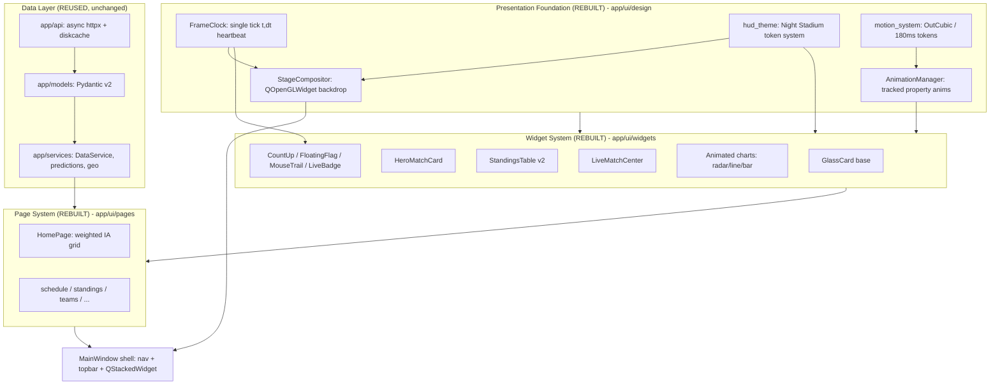
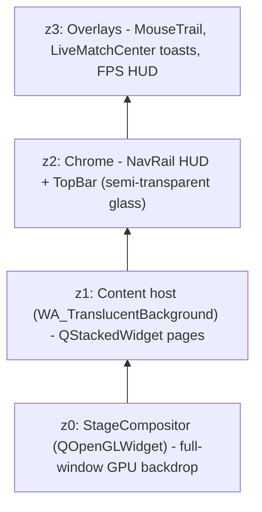
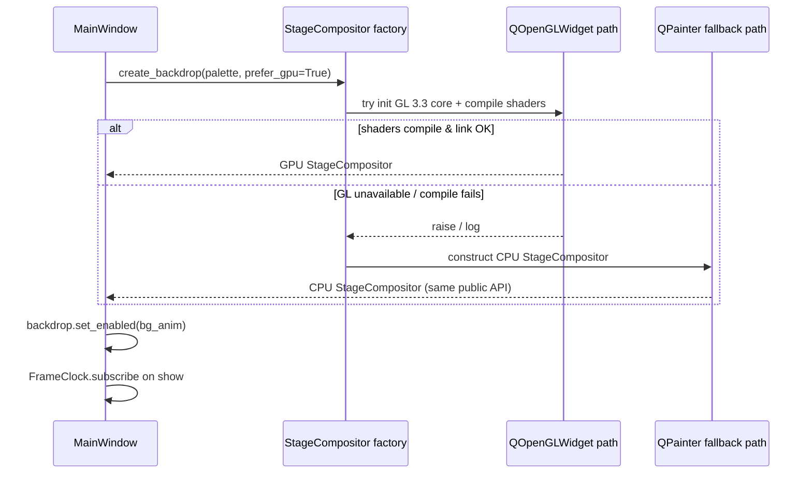
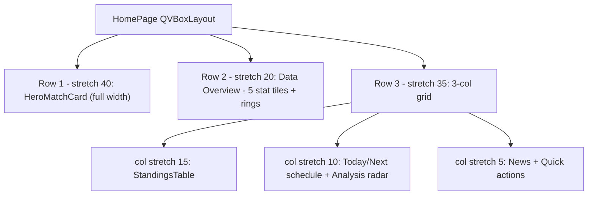

# Design Document: WorldCup 3.0 — FIFA Ultimate Edition (Night Stadium HUD)

## Overview

WorldCup 3.0 is a complete, ground-up rebuild of the **presentation, rendering, and motion layers** of the existing PyQt6 desktop application (`世界杯赛事终端 / World Cup Console`). The data layer (`app/api`, `app/models`, `app/services`) is preserved and reused unchanged; everything visual above it is rearchitected around a single coherent theme — **"Night Stadium Futuristic HUD"** — targeting the production quality of FIFA Official Match Center, EA FC 26, the UEFA Champions League broadcast package, Apple TV Sports, and FotMob Premium.

The redesign replaces the current sakura/pink/purple multi-skin aesthetic and the three overlapping backdrop implementations (`particle_bg.py`, `gl_backdrop.py`, `skin_backdrop.py`) with one composited, GPU-accelerated, multi-layer stadium-night backdrop, a single unified motion system, a glassmorphism card system, and a broadcast-grade home page whose layout enforces a strict information hierarchy. All animation continues to be driven by the existing single `FrameClock` heartbeat (no proliferation of `QTimer`s), and all network/data work continues to run off the main thread.

This design is intentionally **layered**: a stable rendering/motion/theme foundation (`app/ui/design/`) that higher-level widgets and pages consume. The architecture is described first at the high level (system diagrams, layers, component contracts, data/render models) and then at the low level (concrete PyQt6 class and method signatures, render-loop algorithms, motion curves, formal specifications).

---

## Architecture

### System Layering



### Compositing / Z-order

The window is composited as a stack of translucent layers. The animated backdrop is the bottom-most layer rendered on the GPU; the Qt widget tree (chrome + content) is painted on top with translucent backgrounds so the backdrop shows through where intended.



**Key principle (carried over from the current `theme.py` performance note):** the animated backdrop is allowed to show through the *chrome* (nav rail, top bar) and the *hero region*, but long scrolling content bodies paint on an opaque base color so the GPU compositor never has to recomposite the whole widget tree per scroll frame. Glass cards achieve their "floating glass" look by layering semi-transparent fills over that opaque body — visually identical, far cheaper.

### Rendering backend selection



---

## Components and Interfaces

### 1. Design tokens — `app/ui/design/hud_theme.py` (replaces `theme.py` palette + `tokens.py` colors)

**Purpose:** the single source of truth for the Night Stadium HUD visual language — color ramp, glass materials, radii, shadows, typography. Replaces the sakura/pink/purple multi-skin palette set. Structural tokens (spacing 8pt grid, durations, easing) carry over from `tokens.py`.

```python
@dataclass(frozen=True)
class HudPalette:
    name: str = "night-stadium"

    # ── Background ramp (vertical stadium-night gradient) ──
    bg_top: str = "#06111A"          # sky
    bg_mid: str = "#0A1B28"          # mid-field haze
    bg_bottom: str = "#0F2A1F"       # pitch green-black
    bg_opaque_body: str = "#081420"  # opaque scroll-body base (perf)

    # ── HUD accents ──
    primary: str = "#19E3B5"         # HUD teal/mint (selection, focus, live data)
    primary_hi: str = "#5FF4D0"
    secondary: str = "#2D7DF6"       # broadcast blue (links, secondary)
    accent: str = "#FFC23D"          # trophy gold (honors, emphasis)
    floodlight: str = "#EAF6FF"      # cool white floodlight tint

    # ── Semantic ──
    win: str = "#2ED877"
    draw: str = "#FFC857"
    loss: str = "#FF5470"
    live: str = "#FF2D55"            # broadcast live red

    # ── Text ramp ──
    text: str = "#F2F7FA"
    text_dim: str = "#9FB2C0"
    text_faint: str = "#5C7180"

    # ── Glass material ──
    glass_fill: str = "rgba(255,255,255,0.05)"
    glass_border: str = "rgba(255,255,255,0.08)"
    glass_border_hi: str = "rgba(25,227,181,0.35)"

class Radius:    # glass card system
    CARD = 24
    PILL = 999
    CHIP = 12
    INNER = 16

class Shadow:    # (blur_px, dy_px, base_rgba)
    CARD = (40, 10, "rgba(0,0,0,0.40)")   # 0 10px 40px rgba(0,0,0,.4)
    CARD_HOVER = (48, 16, "rgba(0,0,0,0.50)")

class Type:      # typography scale (pt)
    DISPLAY = 40; H1 = 30; H2 = 22; H3 = 18
    BODY = 14; CAPTION = 12; OVERLINE = 11
    W_REGULAR = 400; W_MEDIUM = 600; W_BOLD = 800; W_BLACK = 900
```

**Responsibilities:**
- Expose one frozen `NIGHT_STADIUM` palette instance plus a `build_qss(palette)` that emits the global stylesheet for the HUD look.
- Provide `rgba()`/`mix()` helpers so widgets never hardcode hex values.

### 2. Motion system — `app/ui/design/motion_system.py` (extends `motion.py`, consolidates `animation_manager.py` usage)

**Purpose:** centralize *all* transitions onto a single curve and duration so motion is uniform across the app.

```python
EASE_STANDARD = QEasingCurve.Type.OutCubic   # the ONE curve
DUR_STANDARD = 180                           # the standard duration (ms)
DUR_MAX = 500                                # hard ceiling; >500ms is banned
HOVER_LIFT_DY = -6                           # translateY(-6px) on hover

def std_anim(target, prop: bytes, start, end,
             duration: int = DUR_STANDARD) -> QPropertyAnimation:
    """Create a standard transition. Asserts duration <= DUR_MAX and curve is OutCubic."""

def hover_lift(widget, *, up: bool, duration: int = DUR_STANDARD) -> QPropertyAnimation:
    """Animate widget y by HOVER_LIFT_DY (up) or back to rest (down)."""
```

**Responsibilities:**
- Guarantee invariant: every transition created through this module uses `OutCubic` and `duration <= 500ms` (asserted in debug, clamped in release).
- Be the only place widgets get hover/enter/exit/page-transition animations from. `AnimationManager` (existing) remains the lifecycle tracker/registry that `motion_system` builds on.

### 3. Stage compositor (backdrop + particle + floodlight engine) — `app/ui/widgets/stage_compositor.py`

**Purpose:** one composited, GPU-accelerated, full-window backdrop that renders all five ambient layers + the particle engine + the floodlight sweep. Replaces `particle_bg.py`, `gl_backdrop.py`, and `skin_backdrop.py`.

```python
class StageCompositor(QOpenGLWidget):
    """Full-window night-stadium backdrop. Public API mirrors the existing
    SkinBackdrop/GLBackdrop so MainWindow can hot-swap it.
    A CPU QPainter fallback (StageCompositorCPU) implements the same interface."""

    def set_palette(self, palette: HudPalette) -> None: ...
    def set_enabled(self, on: bool) -> None: ...   # user toggle; stops FrameClock sub
    def set_paused(self, paused: bool) -> None: ... # page-level pause (e.g. globe page)
    # internal: subscribes to FrameClock.tick on show, unsubscribes on hide
```

**Responsibilities:** see "Rendering Architecture" and the layer/particle/floodlight sections below.

### 4. Glass card base — `app/ui/widgets/glass_card.py` (replaces `misc.Card`)

```python
class GlassCard(QFrame):
    """radius 24, fill rgba(255,255,255,0.05), border rgba(255,255,255,0.08),
    shadow 0 10px 40px rgba(0,0,0,0.4). Hover: translateY(-6px) over 180ms +
    border -> glass_border_hi. Uses ONE QGraphicsDropShadowEffect; hover
    animates cheap 'pos'/'offset', never blurRadius (per existing perf lesson)."""
    def __init__(self, *, glow: str | None = None, hover: bool = True): ...
```

### 5. Hero match card — `app/ui/widgets/hero_match_card.py` (replaces `hero_banner.py` + home `LiveMatchPanel`)

```python
class HeroMatchCard(GlassCard):
    def set_match(self, m: Match, meta: HeroMeta) -> None: ...
    # renders: flags + names + VS, stage/round label, date/time,
    # live 1s countdown, win/draw/loss probability split bar,
    # action buttons, per-team Elo / FIFA rank / world rank.
```

### 6. Standings table v2 — `app/ui/widgets/standings_table.py`

```python
class StandingsTable(GlassCard):
    def set_group(self, g: GroupStanding, form: dict[str, list[str]],
                  rank_delta: dict[str, int], qual_prob: dict[str, float],
                  gd_series: dict[str, list[int]]) -> None: ...
    # row: rank | flag | name | last-5 form pills | rank-change arrow |
    #      qualification-probability bar | GD sparkline | pts
```

### 7. Live match center — `app/ui/widgets/live_match_center.py` (new)

```python
class LiveMatchCenter(GlassCard):
    def set_live(self, m: Match) -> None: ...
    def push_event(self, ev: MatchEvent) -> None:  # GOAL / CARD / VAR / SUB
        """Animates an event row sliding in from the top (180ms OutCubic)."""
```

### 8. Effect widgets — `app/ui/widgets/fx/`
`CountUpNumber`, `FloatingFlag`, `MouseTrailOverlay`, `LiveBadge` (red breathing), `QualBar`, `FormPills`, `MiniSparkline`. All FrameClock- or AnimationManager-driven; none owns a private `QTimer` except the hero's 1-second countdown clock.

---

## Information Architecture (Home Page)

The home page layout enforces a fixed visual-weight hierarchy. Weights are expressed as Qt layout stretch factors / row height budgets so the proportions hold as the window resizes.

| Region | Target weight | Widget | Enforcement |
|---|---|---|---|
| Hero Match | 40% | `HeroMatchCard` | top row, `setStretch` 40, min-height dominant |
| Data Overview | 20% | stat tiles + ring/charts | row stretch 20 |
| Standings | 15% | `StandingsTable` (focus group) | row/column stretch 15 |
| Schedules | 10% | today/next fixtures list | stretch 10 |
| Analysis | 10% | radar + win-prob | stretch 10 |
| Other (news/quick actions) | 5% | compact list | stretch 5 |



```python
class HomePage(BasePage):
    """Weighted IA grid. _build_layout sets stretch factors so the
    Hero:Overview:Standings:Schedule:Analysis:Other ratio = 40:20:15:10:10:5."""
    WEIGHTS = {"hero": 40, "overview": 20, "standings": 15,
               "schedule": 10, "analysis": 10, "other": 5}
```

---

## Data Models (render/view models)

These are lightweight view models that adapt the existing reused Pydantic `Match`/`TeamStanding` models to the new widgets. Computation (Elo, win-prob, qualification probability) lives in `app/services` (reused/extended), not in widgets.

```python
@dataclass(frozen=True)
class HeroMeta:
    stage_label: str                 # e.g. "Group A · Matchday 2"
    kickoff_utc: datetime | None
    win_prob: tuple[int, int, int]   # (home, draw, away), sums to 100
    home_elo: int; away_elo: int
    home_fifa_rank: int; away_fifa_rank: int
    home_world_rank: int; away_world_rank: int

@dataclass(frozen=True)
class MatchEvent:
    kind: Literal["GOAL", "YELLOW", "RED", "VAR", "SUB"]
    minute: int
    team_side: Literal["home", "away"]
    text: str

@dataclass(frozen=True)
class ParticleSpec:
    count: int          # 80..120
    kind: Literal["dust", "grass", "glint"]
    speed_px_per_frame: float   # 0.1..0.3
    opacity: float      # 0.05..0.15
```

**Validation rules:**
- `win_prob` components are each in `[0,100]` and sum to exactly `100`.
- `ParticleSpec.count` in `[80,120]`; `speed_px_per_frame` in `[0.1,0.3]`; `opacity` in `[0.05,0.15]`.
- `kickoff_utc` is timezone-aware (UTC) or `None`.

---

## Rendering Architecture

### Approach

GPU-accelerated compositing via a single `QOpenGLWidget` (`StageCompositor`) that draws a full-screen triangle and computes the entire backdrop (gradient + floodlights + grass texture/noise + pitch markings + trophy silhouette + particles + floodlight sweep + bottom glow) in one fragment shader. This is the proven pattern already present in `gl_backdrop.py` (`#version 330 core`, full-screen triangle, per-frame uniforms only). The redesign extends that shader to the five-layer night-stadium scene and the typed particle engine, and elevates it from an optional backend to the primary one.

The compositor sits at z0, beneath the Qt widget tree. The content host and chrome use `Qt.WidgetAttribute.WA_TranslucentBackground` (chrome/hero) so the GPU layer shows through. A **CPU `QPainter` fallback** (`StageCompositorCPU`) implements the identical public API and the identical layer stack using the existing `SkinBackdrop` techniques (offscreen low-res buffer via `BACKDROP_RENDER_SCALE`, cached glow sprites, particle-scale clamp) for machines without a usable GL 3.3 context. `MainWindow` selects the backend at construction and can hot-swap at runtime, exactly as it does today.

### Per-frame render loop

The compositor subscribes to the existing global `FrameClock.tick(t, dt)` on `showEvent` and unsubscribes on `hideEvent` (ref-counted auto start/stop). It throttles its own redraws to ~60 FPS by accumulating `dt` (the FrameClock itself may run at up to 240 Hz to keep widget transitions silky; the ambient backdrop does not need to). Because motion is time-driven (`t`, `dt`), visual speed is identical at any frame rate.

```pascal
PROCEDURE on_frame(t, dt)              // subscribed to FrameClock.tick
    bg_accum <- bg_accum + dt
    IF bg_accum < (1/60) THEN RETURN   // throttle ambient layer to ~60fps
    bg_accum <- 0
    self.time <- t                     // single uniform; shader does the rest
    self.update()                      // schedules paintGL
END PROCEDURE

PROCEDURE paintGL()                    // GPU path
    clear(bg_top)
    bind(program)
    set_uniform(u_time, self.time)
    set_uniform(u_res, width, height)
    set_uniform(u_ramp, bg_top, bg_mid, bg_bottom)
    set_uniform(u_accents, primary, floodlight, accent)
    draw_fullscreen_triangle()         // shader composites L1..L5 + sweep
END PROCEDURE
```

In the shader, the five ambient layers + sweep + particles are composited in order (L1 base ramp → L2 floodlight pools → L3 grass texture/noise → L4 pitch markings → L5 trophy silhouette → particle engine → floodlight sweep → bottom breathing glow → vignette). On the CPU fallback the same order is drawn with `QPainter` primitives into the low-res offscreen buffer, then blitted.

### Why this replaces the three current backdrops
- `skin_backdrop.py` (CPU, 4 scenes) → folded into `StageCompositorCPU` with a single night-stadium scene.
- `gl_backdrop.py` (GPU) → becomes `StageCompositor` (GPU primary), scene extended to the 5-layer model + typed particles.
- `particle_bg.py` (per-hero-region CPU particles + meteors) → deleted; particles are now part of the unified compositor (no petals/meteors/sakura).

---

## Layered Background System

Composited bottom-to-top inside `StageCompositor`:

| Layer | Content | Spec |
|---|---|---|
| **L1 Base** | Vertical stadium-night gradient | top `#06111A` → mid `#0A1B28` → bottom `#0F2A1F` |
| **L2 Floodlights** | Large radial light pools near top | ~8% opacity, soft falloff (blur ≈120px equivalent) |
| **L3 Grass/noise** | Subtle pitch texture + field noise | 3–5% opacity |
| **L4 Pitch markings** | Faint center circle + center line | ~2% opacity |
| **L5 Trophy silhouette** | Faint World Cup trophy, centered | ~2% opacity, ambient only (no animation) |

```pascal
FUNCTION composite_ambient(uv, t) : color    // executed per pixel (shader) / per region (CPU)
    c <- vertical_ramp(uv.y, BG_TOP, BG_MID, BG_BOTTOM)             // L1
    c <- c + floodlight_pools(uv, t) * 0.08                        // L2
    c <- c + grass_noise(uv) * uniform(0.03, 0.05)                 // L3
    c <- c + pitch_markings(uv) * 0.02                             // L4
    c <- c + trophy_silhouette(uv) * 0.02                          // L5  (no t -> static)
    RETURN c
END FUNCTION
```

**Invariant:** each ambient layer's contribution stays within its specified opacity band; L5 is a pure function of `uv` (independent of `t`).

---

## Particle Engine ("World Cup Particle Engine")

GPU-rendered (procedural in the fragment shader on the GL path; sprite-cached on the CPU fallback). No per-particle Python loop on the GL path.

- **Count:** 80–120 particles.
- **Types:** light dust (`·`), grass blades (`—`), glints (`✦`).
- **Speed:** 0.1–0.3 px/frame (expressed time-driven: `px_per_frame * dt * REF_FPS`).
- **Opacity:** 5–15%.
- **Explicitly banned:** petals, sakura, snow, meteors, or any browser-game style effect.

```python
PARTICLE_COUNT_MIN, PARTICLE_COUNT_MAX = 80, 120
PARTICLE_SPEED_MIN, PARTICLE_SPEED_MAX = 0.1, 0.3     # px/frame at REF_FPS=60
PARTICLE_OPACITY_MIN, PARTICLE_OPACITY_MAX = 0.05, 0.15
PARTICLE_KINDS = ("dust", "grass", "glint")
```

```pascal
PROCEDURE step_particles(dt)           // CPU fallback only; GL path is procedural
    fs <- dt * REF_FPS                 // frame-scale -> frame-rate independent
    FOR each p IN particles DO
        ASSERT PARTICLE_SPEED_MIN <= p.speed <= PARTICLE_SPEED_MAX
        p.y <- p.y - p.speed * fs
        p.phase <- p.phase + drift * fs
        IF p.y < -margin THEN respawn(p) END IF
    END FOR
    ASSERT PARTICLE_COUNT_MIN <= len(particles) <= PARTICLE_COUNT_MAX
END PROCEDURE
```

---

## Floodlight Sweep System

Two large radial gradients sweep left↔right across the scene over an 8-second cycle at ~5% opacity, evoking the Champions League opening / final-night ambiance. Driven by `t` from FrameClock (time-driven, frame-rate independent).

```pascal
FUNCTION floodlight_sweep(uv, t) : intensity
    phase <- (t mod 8.0) / 8.0                 // 0..1 over 8s
    x1 <- lerp(LEFT, RIGHT, ease_inout(phase)) // beam A: left -> right
    x2 <- lerp(RIGHT, LEFT, ease_inout(phase)) // beam B: right -> left
    a  <- radial(uv, x1) + radial(uv, x2)
    RETURN clamp(a, 0.0, 0.05)                 // ~5% opacity ceiling
END FUNCTION
```

**Invariants:** sweep period is 8.0s; combined sweep contribution ≤ ~5% opacity; horizontal position is periodic with period 8s.

---

## Motion Design System (Unified)

One curve, one standard duration, one hover gesture, a hard ceiling on duration.

- **Easing:** `QEasingCurve.Type.OutCubic` everywhere.
- **Standard duration:** 180 ms.
- **Hover:** `translateY(-6px)` over 180 ms.
- **Banned:** any animation duration > 500 ms.

All transitions are produced by `motion_system.std_anim` / `hover_lift`, which are the only sanctioned constructors. `tokens.Duration.FAST` is set to 180 and `Easing.STANDARD` to `OutCubic` to match. The existing `AnimationManager` continues to track lifecycles and expose `active_count()` for the FPS HUD.

```python
def std_anim(target, prop, start, end, duration=DUR_STANDARD):
    assert duration <= DUR_MAX, "animation duration exceeds 500ms ceiling"
    a = QPropertyAnimation(target, prop, target)
    a.setDuration(min(duration, DUR_MAX))
    a.setEasingCurve(EASE_STANDARD)            # always OutCubic
    a.setStartValue(start); a.setEndValue(end)
    return AnimationManager.instance().track(a)
```

**Invariants:** for every animation `A` created via the motion system, `easing(A) == OutCubic` and `duration(A) <= 500`.

---

## Hero Match Card

Full redesign of the focal-match presentation (replaces `hero_banner.py` and the home `LiveMatchPanel`).

Contents:
- Team names + flags + **VS**.
- Stage / round label (e.g. "Group A · Matchday 2").
- Date / time of kickoff.
- **Live countdown** updating every second (days/hours/mins/secs) until kickoff.
- **Win-probability split** bar, e.g. 47 / 26 / 27 (home / draw / away), the three segments summing to 100.
- Action buttons: watch live / pre-match analysis / head-to-head.
- Per-team **Elo rating**, **FIFA ranking**, **world ranking**.

```python
class HeroMatchCard(GlassCard):
    def __init__(self):
        self._cd_timer = QTimer(self); self._cd_timer.setInterval(1000)
        self._cd_timer.timeout.connect(self._tick_countdown)  # the ONE allowed per-second timer

    def set_match(self, m: Match, meta: HeroMeta) -> None:
        # validates meta.win_prob sums to 100, renders split bar segments
        # proportional to (home, draw, away)
        ...

    def _tick_countdown(self) -> None:
        # remaining = kickoff_utc - now(); render dd/hh/mm/ss;
        # remaining is monotonically non-increasing each tick until 0, then stop.
        ...
```

**Invariants:** the rendered probability segments are proportional to `win_prob` and the three values sum to 100; the countdown is monotonically non-increasing and never displays negative time.

---

## Card Design System (Glassmorphism)

Unified across every card in the app:
- Radius **24px**.
- Background `rgba(255,255,255,0.05)`.
- Border `rgba(255,255,255,0.08)`.
- Shadow `0 10px 40px rgba(0,0,0,0.4)`.
- Hover: `translateY(-6px)` over **180 ms** (+ border brightens to `glass_border_hi`).

Implemented once in `GlassCard`; the hover lift animates the cheap `pos` property (never `blurRadius`), reusing the performance lesson encoded in the current `misc.Card`.

```python
class GlassCard(QFrame):
    def enterEvent(self, e):
        if self._hover: motion_system.hover_lift(self, up=True)    # dy = -6, 180ms
    def leaveEvent(self, e):
        if self._hover: motion_system.hover_lift(self, up=False)
```

---

## Dynamic Flag System

Hero flags float vertically by ±3px over a 4-second cycle via `QPropertyAnimation` on a custom `floatY` property (looping, `InOutSine` for the oscillation — this is a continuous ambient loop, not a transition, so it is exempt from the 180ms transition rule but still well under the 500ms ceiling per half-cycle is not applicable; it is a periodic 4s loop).

```python
class FloatingFlag(QWidget):
    """Renders a FlagIcon and bobs it ±3px over a 4s sine cycle."""
    def start_float(self):
        a = QPropertyAnimation(self, b"floatY", self)
        a.setDuration(4000); a.setLoopCount(-1)
        a.setKeyValueAt(0.0, 0.0); a.setKeyValueAt(0.5, 3.0); a.setKeyValueAt(1.0, 0.0)
        a.setEasingCurve(QEasingCurve.Type.InOutSine)
```

**Invariant:** vertical offset stays within `[-3, +3]` px; period is 4s.

---

## Number Count-Up Animation

All data numbers animate from 0 to their target over **800 ms** on page entry, driven by a `QVariantAnimation` (via the existing `AnimationManager.count_up`, retargeted to 800ms / OutCubic). On completion the displayed value equals the target exactly (no rounding drift).

```python
class CountUpNumber(QLabel):
    DURATION = 800
    def set_target(self, target: int) -> None:
        # animates 0 -> target; final frame sets exactly target
        ...
```

**Invariant:** at animation end the rendered integer equals `target` exactly; intermediate values are non-decreasing for non-negative targets.

---

## Standings Upgrade

`StandingsTable` row additions:
- **Last-5 form** pills: `W W D W L` (win=green, draw=amber, loss=red).
- **Rank-change indicator:** `↑2` / `↓1` / `—`.
- **Qualification-probability bar** (0–100%).
- **Goal-difference mini sparkline**.

```python
class FormPills(QWidget):     # renders last 5 results as colored pills
class QualBar(QWidget):       # 0..1 -> filled bar width
class MiniSparkline(QWidget): # GD trend over matchdays
def rank_delta_glyph(delta: int) -> str:   # >0 -> "↑{n}", <0 -> "↓{n}", 0 -> "—"
```

**Invariants:** form pill count ≤ 5 and each pill ∈ {W,D,L}; qualification bar fill width is proportional to probability and clamped to [0,1]; rank-change glyph direction matches the sign of the delta.

---

## Live Match Center (new)

`LiveMatchCenter` shows a live fixture and a feed of events.
- **LIVE badge** with red breathing animation: opacity 100→70→100 loop (FrameClock-driven, like the existing nav `LIVE` badge breathing).
- **Goal events** (`⚽ GOAL`) slide in from the top (180ms OutCubic).
- **Yellow/red card** flash.
- **VAR review** scanline animation.

```python
class LiveBadge(QWidget):
    """opacity oscillates 1.0 -> 0.7 -> 1.0; subscribes to FrameClock."""
class LiveMatchCenter(GlassCard):
    def push_event(self, ev: MatchEvent):
        row = self._make_event_row(ev)
        # slide-in from top: y from -h to rest, 180ms OutCubic via motion_system
        if ev.kind == "VAR": self._play_scanline()
        if ev.kind in ("YELLOW", "RED"): self._flash(ev.kind)
```

**Invariants:** LIVE badge opacity stays within [0.7, 1.0]; every pushed event produces exactly one new event row.

---

## Mouse Trail System

A subtle trailing-dot overlay (`MouseTrailOverlay`, z3, `WA_TransparentForMouseEvents`) following the cursor: **3–5 dots** with decreasing opacity. Deliberately subtle — not exaggerated browser-game trails. Driven by FrameClock; positions are a short ring buffer of recent cursor samples.

```python
class MouseTrailOverlay(QWidget):
    MAX_DOTS = 5
    def _on_frame(self, t, dt):
        # push current cursor pos, keep last MAX_DOTS, fade opacity by index
        ...
```

**Invariants:** at most 5 dots are ever rendered; dot opacity is strictly decreasing from head to tail.

---

## Chart System

Animated, broadcast-style charts (`app/ui/widgets/charts/`):
- **Radar** drawn dynamically (vertices animate outward to their values).
- **Line charts** draw left-to-right (progressive path reveal).
- **Bar charts** grow in height.
- All use a **300 ms** eased refresh (OutCubic).

```python
class RadarChart(QWidget):  def set_data(self, series): # animate progress 0->1
class LineChart(QWidget):   def set_series(self, pts):  # reveal fraction 0->1 L->R
class BarChart(QWidget):    def set_bars(self, values): # height fraction 0->1
CHART_REFRESH_MS = 300
```

**Invariant:** chart reveal progress animates monotonically 0→1 and settles at the exact data values.

---

## Performance Architecture

Target **60 FPS+ globally**.
- Prefer `QOpenGLWidget` (GPU compositor) over heavy `QGraphicsOpacityEffect`/`blurRadius` repaints. Hover/elevation animate `pos`/`offset`, never `blurRadius` (existing lesson in `misc.Card`/`effects.BreathingGlow`).
- `WA_TranslucentBackground` for chrome/hero so the GPU layer composites cleanly; opaque body for scrolling content to avoid full-tree recomposition.
- `QPixmapCache` for flags/logos/sprites (extends the current image cache + glow-sprite cache).
- `QThreadPool` for async network/data loading; **never** issue API requests on the main thread — all data goes through the existing async `DataService` (httpx + diskcache) off the GUI thread.
- Single `FrameClock` heartbeat with ref-counted start/stop (no per-widget timers, except the one 1-second hero countdown). Ambient backdrop throttled to ~60 FPS even when the clock runs faster.
- CPU fallback uses offscreen low-res render scale (`BACKDROP_RENDER_SCALE`) and particle-count clamp (`BACKDROP_PARTICLE_SCALE`).

**Invariants:** no network call originates on the GUI/main thread; no animation drives `blurRadius` per frame; total live per-widget timers (excluding FrameClock and the hero countdown) is zero.

---

## First-Open Experience

On first paint the home screen composes the full broadcast scene:
- Stadium-night vertical gradient base.
- Sweeping floodlights (8s cycle).
- Drifting light dust particles (80–120, 5–15% opacity).
- Floating hero flags (±3px / 4s).
- Ticking live countdown (per-second).
- Rolling count-up numbers (0→target, 800ms).
- Live-updating standings (form, rank deltas, qualification bars, GD sparkline).
- Faint grass texture + centered trophy silhouette.
- Glowing top HUD nav (semi-transparent glass chrome).
- Premium glass cards (radius 24, glass fill/border, soft shadow).

```mermaid
sequenceDiagram
    participant MW as MainWindow
    participant SC as StageCompositor
    participant FC as FrameClock
    participant H as HomePage
    MW->>SC: show() -> subscribe(FC.tick); render L1..L5 + sweep + particles
    MW->>H: navigate("home"); fade+slide page in (180ms)
    H->>H: HeroMatchCard.set_match -> start countdown (1s) + flags float (4s)
    H->>H: CountUpNumber.set_target -> 0..target over 800ms
    H->>H: StandingsTable.set_group -> form/deltas/qual/sparkline
    FC-->>SC: tick(t,dt) ~60fps -> ambient redraw
    FC-->>H: tick(t,dt) -> LiveBadge breathing, trail
```

---

## Error Handling

| Scenario | Condition | Response | Recovery |
|---|---|---|---|
| GL context/shader failure | GL 3.3 unavailable or shader link fails | Log warning; construct `StageCompositorCPU` with identical API | App runs on CPU backdrop; user can retry GPU in settings |
| Data fetch failure | `DataService` raises (network/timeout) | Page shows existing empty/error state; widgets keep last good data | Auto-refresh retries on next 30s tick; manual refresh available |
| Missing hero meta (Elo/rank/prob) | service returns partial data | Render placeholders ("—"); probability bar hidden if `win_prob` invalid | Fields populate on next refresh |
| Countdown past kickoff | `kickoff_utc <= now` | Stop the 1s timer; show "LIVE"/"KICK-OFF" | Switches to live scoreline when match goes live |
| Low-performance mode | `WC_LITE=1` / `LOW_PERF` | FrameClock not started; static gradient backdrop only | Transitions become instant; UI fully functional |

---

## Correctness Properties

*A property is a characteristic or behavior that should hold true across all valid executions of the system — a formal, machine-verifiable statement of intent. These are written for later property-based testing (see Testing Strategy).*

### Property 1: Motion easing is uniform
For all animations created through the motion system, the easing curve is `OutCubic`.

### Property 2: Animation duration ceiling
For all animations created through the motion system, the effective duration is ≤ 500 ms.

### Property 3: Hover lift magnitude
For all glass cards, entering hover moves the card to `restY - 6px` and leaving returns it exactly to `restY`.

### Property 4: Particle count bound
For all valid `ParticleSpec` / compositor states, the active particle count is within `[80, 120]`.

### Property 5: Particle speed bound
For all particles, the per-frame speed is within `[0.1, 0.3]` px/frame (at the reference frame rate).

### Property 6: Particle opacity bound
For all particles, the rendered opacity is within `[0.05, 0.15]`.

### Property 7: Ambient layer opacity bands
For all pixels/regions, each ambient layer's contribution stays within its specified opacity band (floodlights ~8%, grass 3–5%, pitch markings ~2%, trophy ~2%).

### Property 8: Floodlight sweep periodicity
For all times `t`, the floodlight sweep horizontal position is periodic with period 8 s, and its combined opacity contribution is ≤ ~5%.

### Property 9: Trophy silhouette is static
For all times `t`, the trophy-silhouette layer output depends only on position (`uv`), not on `t`.

### Property 10: Countdown monotonicity
For all consecutive countdown ticks before kickoff, the displayed remaining time is non-increasing and never negative.

### Property 11: Count-up reaches exact target
For all non-negative targets, the count-up animation's final rendered value equals the target exactly, and intermediate values are non-decreasing.

### Property 12: Win-probability split integrity
For all hero matches, the win/draw/loss segments are proportional to `win_prob` and the three values sum to exactly 100.

### Property 13: No main-thread network
For all data loads, the network request executes off the GUI/main thread.

### Property 14: Form pills validity
For all standings rows, at most 5 form pills are rendered and each pill is one of {W, D, L}.

### Property 15: Rank-change glyph correctness
For all rank deltas `d`, the glyph is `↑n` when `d>0`, `↓n` when `d<0`, and `—` when `d=0`, where `n=|d|`.

### Property 16: Qualification bar proportionality
For all qualification probabilities `p ∈ [0,1]`, the rendered bar fill fraction equals `clamp(p, 0, 1)`.

### Property 17: Mouse trail bound & fade
For all cursor motion, at most 5 trail dots are rendered and their opacities are strictly decreasing from head to tail.

### Property 18: LIVE badge opacity bound
For all times, the LIVE badge opacity stays within `[0.7, 1.0]`.

### Property 19: Live event row creation
For all events pushed to the Live Match Center, exactly one new event row is created per event.

### Property 20: Chart reveal settles at data
For all chart datasets, the reveal progress animates monotonically from 0 to 1 and the settled geometry matches the input data values.

### Property 21: Frame-rate independence
For all frame rates supported by `FrameClock` (30–240 Hz), time-driven motion (particles, sweep, breathing) advances at the same real-time speed.

### Property 22: Backend API equivalence
For all public compositor methods (`set_palette`, `set_enabled`, `set_paused`), the GPU and CPU backends accept identical calls and produce the same observable state transitions.

---

## Testing Strategy

### Unit Testing
- Pure helpers: `rank_delta_glyph`, `win_prob` segment math, `qual` clamp, countdown decomposition (s → dd/hh/mm/ss), color/rgba token helpers.
- View-model validation (`HeroMeta`, `ParticleSpec`, `MatchEvent`) bounds.
- Specific edge cases: kickoff exactly at `now`, `win_prob` not summing to 100 (rejected), empty standings group.

### Property-Based Testing
- Library: **Hypothesis** (Python).
- Each property test references its design property and runs ≥ 100 iterations.
- Tag format: **Feature: worldcup-ultimate-redesign, Property {n}: {property_text}**.
- Generators: random `ParticleSpec`s, random `win_prob` triples, random rank deltas, random form sequences, random qualification probabilities, random target integers, random frame-rate / dt sequences for time-driven motion, random cursor paths.
- Properties amenable to PBT: 1, 2, 3, 4, 5, 6, 8, 10, 11, 12, 14, 15, 16, 17, 18, 20, 21 (logic/math/bounds testable headlessly). Shader-pixel properties (7, 9) and threading/observable-state properties (13, 19, 22) are validated via targeted unit/integration tests rather than randomized pixel sampling.

### Integration Testing
- Backend selection/hot-swap (GPU → CPU fallback) keeps the app running.
- Page navigation triggers count-up, countdown, and standings population.
- `LOW_PERF` path renders a static backdrop and instant transitions without errors.

---

## Performance Considerations

- One GPU draw call per ambient frame (full-screen triangle); Python uploads only a handful of float uniforms.
- Ambient backdrop throttled to ~60 FPS independent of the (up to 240 Hz) FrameClock used for crisp widget transitions.
- Opaque scroll bodies prevent full-tree recomposition on scroll.
- Cached sprites/pixmaps; no per-frame gradient allocation on the CPU fallback.
- Hover/elevation never re-blurs shadows.

## Security Considerations

- No new network surface; all requests go through the existing read-only public `DataService` endpoints off-thread.
- No user-authored code execution; no PII handling changes.

## Dependencies

- **Reused:** PyQt6 (Widgets, OpenGL, OpenGLWidgets), `qasync`, `httpx`, `diskcache`, `pydantic` v2, `platformdirs` — all already present.
- **Foundation modules touched/added:** `app/ui/design/hud_theme.py`, `app/ui/design/motion_system.py` (extends `motion.py`), `app/ui/widgets/stage_compositor.py` (+ CPU fallback), `app/ui/widgets/glass_card.py`, `app/ui/widgets/hero_match_card.py`, `app/ui/widgets/standings_table.py`, `app/ui/widgets/live_match_center.py`, `app/ui/widgets/fx/*`, `app/ui/widgets/charts/*`.
- **Testing (new dev dependency):** `hypothesis`.
- **No new runtime third-party dependencies** (particles are procedural in GLSL / sprite-cached on CPU; no numpy).

---

## Migration / Refactor Strategy (Replaced vs Reused)

### Reused (unchanged)
- `app/api/*`, `app/models/*`, `app/services/*` — all data acquisition, caching, prediction, geo/stadium logic.
- `app/ui/design/frame_clock.py` — the single animation heartbeat (the architectural keystone).
- `app/ui/design/animation_manager.py` — lifecycle tracking / `active_count()` (retargeted durations).
- `app/config.py` performance flags (`LOW_PERF`, `BACKDROP_RENDER_SCALE`, `BACKDROP_PARTICLE_SCALE`, `GPU_BACKDROP`, `ANIM_FPS`).
- `MainWindow` shell structure (nav + topbar + `QStackedWidget`, backdrop hot-swap, ref-counted subscriptions) — adapted, not rewritten.

### Replaced / Removed
- `app/ui/theme.py` multi-skin palette set → single `hud_theme.NIGHT_STADIUM` palette + `build_qss` (sakura/pink/purple skins removed).
- `app/ui/widgets/skin_backdrop.py`, `gl_backdrop.py`, `particle_bg.py` → unified `StageCompositor` (GPU) + `StageCompositorCPU` (fallback), single night-stadium scene, typed particle engine, no petals/meteors.
- `app/ui/widgets/hero_banner.py` + home `LiveMatchPanel` → `HeroMatchCard`.
- `app/ui/widgets/misc.Card` → `GlassCard` (24px radius glass system).
- Per-page ad-hoc accent colors (e.g. `home_page.py` `C_PRIMARY`/`C_PURPLE` constants) → tokens from `hud_theme`.

### Phased rollout
1. **Foundation:** `hud_theme`, `motion_system`, `glass_card`, `StageCompositor` (+ CPU fallback) wired into `MainWindow`; remove old backdrops/skins.
2. **Hero & home IA:** `HeroMatchCard`, weighted `HomePage` grid, count-up, floating flags, mouse trail.
3. **Standings & charts:** `StandingsTable` v2, animated radar/line/bar.
4. **Live center:** `LiveMatchCenter` with goal/card/VAR animations.
5. **Sweep over remaining pages:** migrate every other page's cards to `GlassCard` + tokens.
6. **Cleanup:** delete dead modules, finalize property/unit/integration tests.
