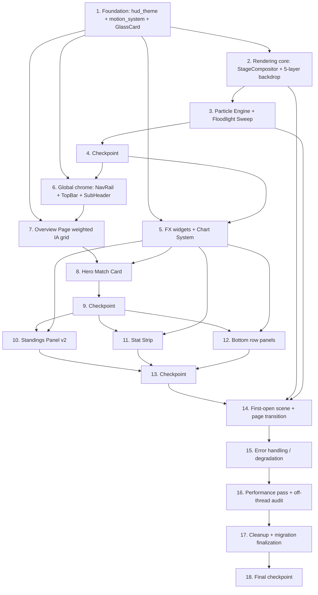

# Implementation Plan: WorldCup 3.0 — FIFA Ultimate Edition (Night Stadium HUD)

## Overview

This plan rebuilds the **presentation, rendering, and motion layers** of the existing PyQt6
World Cup Console into the "Night Stadium Futuristic HUD" Overview dashboard that matches the
supplied mockup 1:1, while reusing the existing data layer (`app/api`, `app/models`,
`app/services`) and the architectural keystones (`FrameClock`, `AnimationManager`,
`app/config.py` perf flags, the `MainWindow` shell) unchanged.

Implementation language is **Python 3 / PyQt6** (the design specifies concrete PyQt6 classes).
Property-based tests use **Hypothesis** (new dev dependency); each property test runs ≥ 100
iterations and is tagged `Feature: worldcup-ultimate-redesign, Property {n}: {property_text}`.

The plan is incremental: every task builds on prior tasks and ends by wiring new code into the
running shell, so there is no orphaned code. Phases follow the design's phased rollout
(Foundation → Rendering core → Particles/Sweep → Widgets → Chrome → Overview composition →
Hero → Standings → Stat strip → Bottom panels → Performance → Test hardening).

Tasks marked with `*` are optional test sub-tasks and may be skipped for a faster MVP; core
implementation tasks are never optional. Property-based tests are only attached where the design
defines a Correctness Property; pure-rendering, threading, and observable-state properties
(7, 9, 13, 19, 22) are validated via targeted unit/integration tests, per the design's Testing
Strategy.

---

## Tasks

- [x] 1. Foundation: theme tokens, motion system, and glass card base
  - [x] 1.1 Create `app/ui/design/hud_theme.py` token system
    - Implement the frozen `HudPalette` dataclass with the Night Stadium ramp, accents, semantic, text, and glass-material tokens; expose a single `NIGHT_STADIUM` instance
    - Implement `Radius`, `Shadow`, `Type` token classes and `rgba()` / `mix()` helpers (no hardcoded hex in widgets)
    - Implement `build_qss(palette)` emitting the global HUD stylesheet
    - _Requirements: 16.2, 20.1_

  - [x]* 1.2 Write unit tests for token helpers
    - Test `rgba()`/`mix()` output formatting and clamping; assert gradient ramp values match `#06111A`/`#0A1B28`/`#0F2A1F`
    - _Requirements: 16.2, 20.1_

  - [x] 1.3 Create `app/ui/design/motion_system.py` built on `AnimationManager`/`tokens`
    - Define `EASE_STANDARD = OutCubic`, `DUR_STANDARD = 180`, `DUR_MAX = 500`, `HOVER_LIFT_DY = -6`
    - Implement `std_anim(...)` (asserts/clamps duration ≤ 500, always OutCubic, registers with `AnimationManager`) and `hover_lift(widget, up, ...)`
    - Retarget `tokens.Duration.FAST = 180` and `Easing.STANDARD = OutCubic`
    - _Requirements: 19.1, 19.2, 19.3_

  - [x]* 1.4 Write property test for motion easing uniformity
    - **Property 1: Motion easing is uniform** — for any animation created via the motion system, easing curve is OutCubic
    - **Validates: Requirements 19.1**

  - [x]* 1.5 Write property test for animation duration ceiling
    - **Property 2: Animation duration ceiling** — for any requested duration, the created animation's effective duration is ≤ 500 ms
    - **Validates: Requirements 19.2**

  - [x] 1.6 Create `app/ui/widgets/glass_card.py` (`GlassCard`) replacing `misc.Card`
    - Radius 24, fill `rgba(255,255,255,0.05)`, border `rgba(255,255,255,0.08)`, single `QGraphicsDropShadowEffect` `0 10px 40px rgba(0,0,0,0.4)`
    - `enterEvent`/`leaveEvent` call `motion_system.hover_lift` (animate `pos`, never `blurRadius`); hover brightens border to `glass_border_hi`
    - _Requirements: 20.1, 20.2, 20.3, 19.4_

  - [x]* 1.7 Write property test for hover lift magnitude
    - **Property 3: Hover lift magnitude** — for any glass card at rest `restY`, entering hover targets `restY - 6` and leaving returns exactly to `restY`
    - **Validates: Requirements 19.4, 20.3**

- [x] 2. Rendering core: Stage Compositor (GPU + CPU fallback) and night-stadium backdrop
  - [x] 2.1 Define the Stage Compositor public API and backend factory
    - Create `app/ui/widgets/stage_compositor.py` with `StageCompositor(QOpenGLWidget)` and `StageCompositorCPU` sharing identical `set_palette`/`set_enabled`/`set_paused` and FrameClock subscribe-on-show / unsubscribe-on-hide behavior
    - Implement `create_backdrop(palette, prefer_gpu=True)` factory: try GL 3.3 core + shader compile/link, fall back to CPU on failure with a logged warning
    - _Requirements: 27.1, 27.2, 25.1_

  - [x] 2.2 Implement the 5-layer night-stadium backdrop (both backends)
    - GPU: full-screen-triangle fragment shader compositing L1 base ramp → L2 floodlight pools → L3 grass/noise → L4 pitch markings → L5 trophy silhouette, with per-frame `u_time`/`u_res`/`u_ramp`/`u_accents` uniforms only
    - CPU: identical layer order drawn into a low-res offscreen buffer (`BACKDROP_RENDER_SCALE`) then blitted; expose `composite_ambient(uv, t)` logic so layer opacity bands are inspectable
    - Enforce opacity bands: floodlights ~8%, grass 3–5%, pitch markings ~2%, trophy ~2%; L5 independent of `t`
    - _Requirements: 16.1, 16.2, 16.3, 16.4_

  - [x]* 2.3 Write unit tests for ambient layer opacity bands and static trophy
    - **Property 7: Ambient layer opacity bands** — sample `composite_ambient` contributions, assert each layer stays within its band
    - **Property 9: Trophy silhouette is static** — assert L5 output for fixed `uv` is identical across varied `t`
    - **Validates: Requirements 16.3, 16.4**

  - [x] 2.4 Implement per-frame render loop and ~60 FPS ambient throttle
    - `on_frame(t, dt)` accumulates `dt` and throttles ambient redraw to ~60 FPS; `paintGL` uploads uniforms and draws one full-screen triangle
    - _Requirements: 25.1, 25.2_

  - [x] 2.5 Wire Stage Compositor into `MainWindow` and remove old backdrops
    - Replace `skin_backdrop.py` / `gl_backdrop.py` usage with `create_backdrop(...)` at z0; set chrome/hero `WA_TranslucentBackground` and opaque scroll body
    - Hot-swap to CPU backend at runtime on detected GPU failure; honor `set_enabled` user toggle
    - _Requirements: 16.5, 27.2, 27.3, 27.4_

  - [x]* 2.6 Write integration test for backend selection/equivalence
    - **Property 22: Backend API equivalence** — drive identical `set_palette`/`set_enabled`/`set_paused` call sequences on both backends; assert identical observable state transitions and that GPU-failure path constructs the CPU backend without crashing
    - **Validates: Requirements 27.1, 27.2, 27.3, 27.4**

- [x] 3. Particle Engine and Floodlight Sweep (single-FrameClock driven)
  - [x] 3.1 Implement the Particle Engine
    - Add `ParticleSpec` view model (count 80–120, kind ∈ {dust,grass,glint}, speed 0.1–0.3 px/frame, opacity 0.05–0.15) with validation
    - GPU: procedural particles in-shader; CPU: sprite-cached `step_particles(dt)` using frame-scale `dt * REF_FPS`; ban petals/sakura/snow/meteors
    - _Requirements: 17.1, 17.2, 17.3, 17.4, 17.5_

  - [x]* 3.2 Write property tests for particle bounds
    - **Property 4: Particle count bound** — for any compositor state, active count ∈ [80,120]
    - **Property 5: Particle speed bound** — for any particle, per-frame speed ∈ [0.1,0.3]
    - **Property 6: Particle opacity bound** — for any particle, opacity ∈ [0.05,0.15]
    - **Validates: Requirements 17.1, 17.2, 17.3**

  - [x] 3.3 Implement the Floodlight Sweep
    - Two radial beams swept left↔right via `floodlight_sweep(uv, t)`, periodic position with period 8 s, combined opacity ≤ ~5%, derived from FrameClock `t` (frame-rate independent)
    - _Requirements: 18.1, 18.2, 18.3_

  - [x]* 3.4 Write property test for floodlight sweep periodicity
    - **Property 8: Floodlight sweep periodicity** — for any `t`, position at `t` equals position at `t + 8.0`, and combined opacity ≤ ~5%
    - **Validates: Requirements 18.1, 18.2**

  - [x]* 3.5 Write property test for frame-rate independence
    - **Property 21: Frame-rate independence** — for random `dt` sequences summing to the same elapsed real time at rates 30–240 Hz, particle/sweep advancement reaches the same state
    - **Validates: Requirements 25.3**

- [x] 4. Checkpoint — foundation and rendering core
  - Ensure all tests pass, ask the user if questions arise.

- [x] 5. Reusable effect widgets and animated chart system
  - [x] 5.1 Implement `CountUpNumber` (`app/ui/widgets/fx/count_up.py`)
    - `QVariantAnimation` 0→target over 800 ms (OutCubic); final frame sets exactly `target`; non-decreasing for non-negative targets
    - _Requirements: 21.1, 21.2, 21.3_

  - [x]* 5.2 Write property test for count-up exact settle
    - **Property 11: Count-up reaches exact target** — for any non-negative target, final rendered value equals target exactly and intermediate values are non-decreasing
    - **Validates: Requirements 21.2, 21.3**

  - [x] 5.3 Implement `FloatingFlag` (`app/ui/widgets/fx/floating_flag.py`)
    - Looping `QPropertyAnimation` on a custom `floatY` property, ±3 px over a 4 s `InOutSine` cycle, wrapping the existing `FlagIcon`
    - _Requirements: 22.1, 22.2_

  - [x] 5.4 Implement `MouseTrailOverlay` (`app/ui/widgets/fx/mouse_trail.py`)
    - z3 overlay with `WA_TransparentForMouseEvents`; FrameClock-driven ring buffer of ≤ 5 cursor samples with strictly decreasing opacity head→tail; reset stored opacities when idle
    - _Requirements: 23.1, 23.2, 23.3, 23.4_

  - [x]* 5.5 Write property test for mouse trail bound and fade
    - **Property 17: Mouse trail bound & fade** — for any cursor path, ≤ 5 dots rendered and opacities strictly decreasing head→tail
    - **Validates: Requirements 23.1, 23.2**

  - [x] 5.6 Implement the animated Chart System (`app/ui/widgets/charts/`)
    - `RadarChart`, `LineChart`, `BarChart` with a shared reveal-progress 0→1 animation; `CHART_REFRESH_MS = 300` eased (OutCubic); settled geometry matches input data
    - _Requirements: 24.1, 24.2, 24.3_

  - [x]* 5.7 Write property test for chart reveal settling
    - **Property 20: Chart reveal settles at data** — for any dataset, reveal progress is monotonic 0→1 and settled geometry equals input values
    - **Validates: Requirements 24.1, 24.2**

- [x] 6. Global chrome: Navigation Rail, Top HUD Bar, Sub-Header
  - [x] 6.1 Rebuild the Navigation Rail on `GlassCard`/`hud_theme`
    - Top glowing "WORLD CUP / FIFA WORLD CUP" logo + trophy mark; the 12 nav items in exact order (概览…设置); footer "数据同步中… 98%" + "v3.0.0 / WORLD CUP 2026"
    - Active-state highlight bound to the current page (概览 active on Overview)
    - _Requirements: 2.1, 2.2, 2.3, 2.4_

  - [x]* 6.2 Write unit test for Navigation Rail ordering and active state
    - Assert nav item labels/order match the spec and only the active page's item is highlighted
    - _Requirements: 2.2, 2.3_

  - [x] 6.3 Rebuild the Top HUD Bar
    - Page title "概览" + subtitle "OVERVIEW"; centered search with placeholder "搜索球队 / 球员 / 比赛…"; notification bell, "CN" region globe, circular profile avatar
    - _Requirements: 3.1, 3.2, 3.3_

  - [x] 6.4 Build the Sub-Header and Live Connection Pill
    - "2026 美加墨世界杯 · 实时数据总览"; "OVERVIEW · 数据来源：懂球帝公开接口"; right-aligned green "实时数据已连接" pill with status dot
    - _Requirements: 4.1, 4.2, 4.3_

- [x] 7. Overview Page composition with weighted IA grid
  - [x] 7.1 Build `HomePage` weighted layout skeleton
    - `QVBoxLayout` rows: Hero row, Stat Strip row, bottom multi-panel row; set stretch factors enforcing Hero:Overview:Standings:Schedule:Analysis:Other = 40:20:15:10:10:5
    - Hero (~65% left) and Standings (~35% right) side-by-side; ratios preserved on resize
    - Wire all data access through the `DataService` (no direct network calls)
    - _Requirements: 1.1, 1.2, 1.3, 1.4, 26.2_

  - [x]* 7.2 Write unit test for IA stretch ratios
    - Assert configured stretch factors equal 40/20/15/10/10/5 and Hero/Standings column split is preserved after a simulated resize
    - _Requirements: 1.2, 1.3_

- [x] 8. Hero Match Card
  - [x] 8.1 Implement `HeroMatchCard` layout and labels
    - Create `app/ui/widgets/hero_match_card.py` (extends `GlassCard`); add `HeroMeta` view model with `win_prob` summing to 100 validation
    - Render stage label "小组赛 第3轮", "即将开始" pill, home flag — VS — away flag with "瑞士 / SWITZERLAND" & "加拿大 / CANADA", "距离开赛" caption + 时/分/秒 flip countdown, "06月25日 03:00" + "BC Place Stadium, Vancouver", action pills 观看直播/赛前分析/历史交锋, left/right carousel chevrons
    - Use `FloatingFlag` for the hero flags
    - _Requirements: 5.1, 5.2, 5.3, 5.4, 5.5, 5.6, 5.7_

  - [x] 8.2 Implement the live countdown (single per-second timer)
    - One `QTimer` at 1000 ms decomposing remaining seconds → dd/hh/mm/ss; non-increasing, never negative; on reaching kickoff, stop timer and show "LIVE"/"KICK-OFF"
    - _Requirements: 6.1, 6.2, 6.3, 6.4_

  - [x]* 8.3 Write property test for countdown monotonicity
    - **Property 10: Countdown monotonicity** — for consecutive ticks before kickoff, displayed remaining time is non-increasing and never negative
    - **Validates: Requirements 6.2**

  - [x] 8.4 Implement the win-probability split bar
    - Three segments home/draw/away left-to-right with red→neutral→blue gradient; labels "47% 瑞士胜"/"26% 平局"/"27% 加拿大胜"; widths proportional to `win_prob`; hide the bar if components do not sum to 100
    - _Requirements: 7.1, 7.2, 7.3, 7.4_

  - [x]* 8.5 Write property test for win-probability split integrity
    - **Property 12: Win-probability split integrity** — for valid triples summing to 100, segment widths are proportional; invalid triples cause the bar to hide
    - **Validates: Requirements 7.3, 7.4**

  - [x] 8.6 Render per-team Elo / FIFA rank / world rank with placeholders
    - Show Elo, FIFA ranking, world ranking per team; render "—" for any missing value
    - _Requirements: 8.1, 8.2_

  - [x]* 8.7 Write unit test for ranking placeholder fallback
    - Assert missing rating/rank values render "—"
    - _Requirements: 8.2_

- [x] 9. Checkpoint — chrome, Overview shell, and Hero
  - Ensure all tests pass, ask the user if questions arise.

- [x] 10. Standings Panel (v2)
  - [x] 10.1 Implement standings helper functions and form/qual/sparkline widgets
    - Add `rank_delta_glyph(delta)`, `FormPills`, `QualBar`, `MiniSparkline` to `app/ui/widgets/fx/`
    - _Requirements: 10.3, 10.5, 10.7_

  - [x]* 10.2 Write property tests for standings helpers
    - **Property 14: Form pills validity** — ≤ 5 pills, each ∈ {W,D,L}
    - **Property 15: Rank-change glyph correctness** — `↑n`/`↓n`/`—` matches sign of delta, n=|delta|
    - **Property 16: Qualification bar proportionality** — fill fraction equals `clamp(p,0,1)`
    - **Validates: Requirements 10.4, 10.7, 10.5**

  - [x] 10.3 Implement `StandingsTable` panel composition
    - Create `app/ui/widgets/standings_table.py` (extends `GlassCard`); header "小组积分榜 / GROUP STANDINGS"; Group Selector tabs A–L (A active by default); footer "查看完整积分榜"
    - Columns in order: # / 球队 / 场次 / 胜平负 / 净胜球 / 积分 / 出线概率 (bar+%) / 最近5场 (form pills)
    - Sample rows 墨西哥 92%, 韩国 56%, 捷克 48%, 南非 4%; tab selection re-renders the chosen group
    - _Requirements: 9.1, 9.2, 9.3, 9.4, 9.5, 10.1, 10.2, 10.6_

  - [x]* 10.4 Write unit test for group selector behavior
    - Assert A active initially; selecting a tab marks it active and renders that group's standings
    - _Requirements: 9.3, 9.4_

- [x] 11. Stat Strip
  - [x] 11.1 Implement the Stat Strip row of six glass stat cards
    - Six equal-width `GlassCard`s left-to-right: 总比赛场次, 总进球数, 进球球员, 平均进球, 参赛球队, 主办城市; each with headline value (from `DataService`), secondary text, icon, deltas/sparkline per spec sample values (104/141/89/2.94/48/16)
    - Headline numbers use `CountUpNumber` on page entry
    - _Requirements: 11.1, 11.2, 11.3, 11.4, 11.5, 11.6, 11.7, 11.8, 11.9, 11.10_

  - [x]* 11.2 Write unit test for Stat Strip composition
    - Assert exactly six cards in the specified order with the sampled headline/secondary/icon content
    - _Requirements: 11.1, 11.2_

- [x] 12. Bottom row panels
  - [x] 12.1 Implement the Today Matches Panel
    - Header "今日赛程 / TODAY'S MATCHES" with live fixture count; time-stamped rows with both flags + score/status; sample rows (葡萄牙 5-0 乌兹别克斯坦 odds, 英格兰 0-0 加纳 已结束, 巴西 VS 塞尔维亚 直播, 法国 VS 沙特阿拉伯 将开赛); footer "查看完整赛程"
    - _Requirements: 12.1, 12.2, 12.3, 12.4_

  - [x] 12.2 Implement `LiveMatchCenter` panel
    - Create `app/ui/widgets/live_match_center.py` (extends `GlassCard`); header "实时比赛 / LIVE MATCH"; red "直播中" `LiveBadge` + live clock; scoreline with flags; event timeline over mini pitch (sample 23'/45'/63')
    - `LiveBadge` opacity breathing 1.0→0.7→1.0 (FrameClock-driven); `push_event` creates exactly one row; goal events slide in from top via `motion_system`; card flash + VAR scanline; footer "进入比赛中心"
    - _Requirements: 13.1, 13.2, 13.3, 13.4, 13.5, 13.6, 13.7, 13.8_

  - [x]* 12.3 Write tests for Live Match Center behaviors
    - **Property 19: Live event row creation** (unit) — each pushed event creates exactly one new row
    - **Property 18: LIVE badge opacity bound** (property) — badge opacity stays within [0.7,1.0]
    - **Validates: Requirements 13.5, 13.7**

  - [x] 12.4 Implement the Top Scorers Panel
    - Header "射手榜 / TOP SCORERS"; ranked rows with circular avatar, rank, player+country, goals; sample rows (梅西 5, 姆巴佩 4, 哈兰德 4, Á. Morata 3); footer "查看完整射手榜"
    - _Requirements: 14.1, 14.2, 14.3, 14.4_

  - [x] 12.5 Implement the Host Cities Panel
    - Header "主办城市 / HOST CITIES"; stylized North America map (USA/Canada/Mexico) with glowing city dots; labelled host cities (温哥华…蒙特雷); footer "查看全部城市"
    - _Requirements: 15.1, 15.2, 15.3, 15.4_

  - [x] 12.6 Wire all bottom panels into the Overview Page bottom row
    - Place Today Matches, Live Match Center, Top Scorers, Host Cities into the weighted bottom row; feed all from `DataService`
    - _Requirements: 1.1, 26.2_

- [x] 13. Checkpoint — full Overview composition renders end-to-end
  - Ensure all tests pass, ask the user if questions arise.

- [x] 14. First-open scene wiring and page transition
  - [x] 14.1 Compose the first-open broadcast scene and navigation transition
    - On first paint, compose gradient + Floodlight Sweep + Particle Engine + Floating Flags + Hero countdown + Count-Up Numbers + populated Standings + grass + trophy in one scene
    - Wire the 180 ms fade-and-slide page transition (via `motion_system`) when the Overview Page becomes active
    - _Requirements: 29.1, 29.2_

- [x] 15. Error handling and graceful degradation
  - [x] 15.1 Implement data and rendering error handling
    - On `DataService` failure, retain last good data and show existing empty/error states; retry on the next scheduled refresh tick
    - `WC_LITE=1` / `LOW_PERF`: Stage Compositor renders a static gradient and Motion System makes transitions instant while keeping the UI functional
    - _Requirements: 28.1, 28.2, 28.3_

  - [x]* 15.2 Write integration test for LOW_PERF and fetch-failure recovery
    - Assert static backdrop + instant transitions under `WC_LITE=1`; assert last-good-data retention and retry-on-next-tick on simulated fetch failure
    - _Requirements: 28.1, 28.2, 28.3_

- [x] 16. Performance pass and off-thread data audit
  - [x] 16.1 Apply performance optimizations
    - `QPixmapCache` for flags/logos/sprites; route data loads through `QThreadPool`/async `DataService`; audit for a single `FrameClock` heartbeat with ref-counted start/stop (only the hero 1 s countdown allowed as an extra timer); ambient backdrop throttled to ~60 FPS
    - Ensure hover/elevation never animates `blurRadius`; opaque scroll bodies prevent full-tree recomposition
    - _Requirements: 25.2, 25.4, 26.1_

  - [x]* 16.2 Write tests for off-thread data and timer audit
    - **Property 13: No main-thread network** (unit/integration) — assert network requests never originate on the GUI thread
    - Assert no live per-widget timers exist other than the FrameClock and the single hero countdown
    - **Validates: Requirements 26.1, 25.4**

- [x] 17. Cleanup and migration finalization
  - [x] 17.1 Remove replaced modules and migrate remaining pages
    - Delete `app/ui/widgets/skin_backdrop.py`, `gl_backdrop.py`, `particle_bg.py`, `hero_banner.py`, and the old home `LiveMatchPanel`; remove the sakura/pink/purple skins from `theme.py`
    - Migrate remaining pages' cards to `GlassCard` + `hud_theme` tokens; replace per-page ad-hoc accent constants with tokens
    - Verify no orphaned imports remain and the app launches on both GPU and CPU backends
    - _Requirements: 16.1, 20.1_

- [x] 18. Final checkpoint — full test suite green
  - Ensure all unit, property-based (≥100 iterations each), and integration tests pass; ask the user if questions arise.

---

## Task Dependency Graph



**Critical path:** 1 → 2 → 3 → 4 → 5 → 8 → 9 → 10/11/12 → 13 → 14 → 15 → 16 → 17 → 18.
Chrome (6) and the Overview shell (7) depend only on the Foundation (1), so they can proceed in
parallel with the rendering branch (2 → 3) before converging at the Hero (8) and the bottom-row
composition (12).

---

## Property → Test Task Map

| Property | Description | Test task | Method |
|---|---|---|---|
| 1 | Motion easing uniform | 1.4 | property |
| 2 | Duration ceiling ≤ 500 ms | 1.5 | property |
| 3 | Hover lift = -6px / exact return | 1.7 | property |
| 4 | Particle count ∈ [80,120] | 3.2 | property |
| 5 | Particle speed ∈ [0.1,0.3] | 3.2 | property |
| 6 | Particle opacity ∈ [0.05,0.15] | 3.2 | property |
| 7 | Ambient layer opacity bands | 2.3 | unit |
| 8 | Floodlight sweep period 8 s, ≤5% | 3.4 | property |
| 9 | Trophy silhouette static in t | 2.3 | unit |
| 10 | Countdown monotonic, non-negative | 8.3 | property |
| 11 | Count-up exact settle | 5.2 | property |
| 12 | Win-prob split sums to 100 | 8.5 | property |
| 13 | No main-thread network | 16.2 | unit/integration |
| 14 | Form pills ≤5 ∈ {W,D,L} | 10.2 | property |
| 15 | Rank-change glyph correctness | 10.2 | property |
| 16 | Qual bar = clamp(p,0,1) | 10.2 | property |
| 17 | Mouse trail ≤5, fading | 5.5 | property |
| 18 | LIVE badge opacity ∈ [0.7,1.0] | 12.3 | property |
| 19 | One event row per push | 12.3 | unit |
| 20 | Chart reveal settles at data | 5.7 | property |
| 21 | Frame-rate independence | 3.5 | property |
| 22 | GPU/CPU backend equivalence | 2.6 | integration |

---

## Notes

- Tasks marked with `*` are optional test sub-tasks and can be skipped for a faster MVP; core
  implementation tasks are never optional.
- Each task references specific requirement clause numbers for traceability.
- The data layer (`app/api`, `app/models`, `app/services`), `FrameClock`, `AnimationManager`,
  and the `MainWindow` shell are reused, not rewritten.
- Property tests use Hypothesis, run ≥ 100 iterations, and carry the tag
  `Feature: worldcup-ultimate-redesign, Property {n}: {property_text}`.
- Properties 7, 9, 13, 19, 22 are validated via targeted unit/integration tests (shader-pixel,
  threading, and observable-state behaviors are not amenable to randomized headless PBT).
- Checkpoints (tasks 4, 9, 13, 18) provide incremental validation gates.
```
